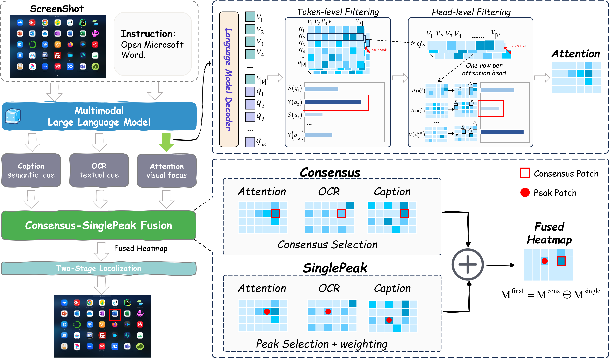

# Trifuse 中文说明

**Trifuse: Enhancing Attention-Based GUI Grounding via Multimodal Fusion**，ICML 2026。

作者：Longhui Ma、Di Zhao（共同第一作者）、Siwei Wang、Zhao Lv、Miao Wang。

Trifuse 根据 GUI 截图与自然语言指令定位目标元素，不需要在 GUI 定位数据上进行任务专用微调。方法结合三类信息：Qwen2.5-VL 的注意力、OCR 识别的文字，以及图标描述的语义。CS（Consensus-SinglePeak）融合同时利用跨模态一致性和受到其他模态支持的尖锐响应，最后通过一次裁剪放大进行精细定位。



## 安装与使用

请按 [安装文档](INSTALL.md) 创建 Conda 环境，安装 PyTorch、PaddlePaddle 和本项目，并准备外部模型权重。默认采用 Qwen2.5-VL-3B，OCR 在 CPU 上运行。

```bash
python -m trifuse --image /path/to/screenshot.png --query "Click the search button" --icon-detector weights/icon_detect/model.pt --caption-model weights/icon_caption --output outputs/prediction.json --visualization outputs/prediction.png
```

Windows 用户可将图片路径替换为 `"E:/screenshots/example.png"`。JSON 中的 `point` 是原图像素坐标，`bbox` 为热力图区域的边界框；`score` 不是经过校准的置信概率。具体流程与字段见 [方法说明](METHOD.md)。

## 发布范围

此仓库仅包含 Trifuse 核心方法、必要辅助代码和单图推理入口，不包含评测脚本、其他方法的实现、训练代码、数据集、权重、实验输出或论文源文件。暂未添加仓库许可证。

依赖版本参考作者本地 Conda 环境整理。本次整理未完成加载全部模型的端到端 GPU 推理，README 中的指标来自论文，不代表整理后的代码已重新跑出相同结果。

英文首页提供论文主要结果和 BibTeX 引用。公开论文链接将在可用时补充。
